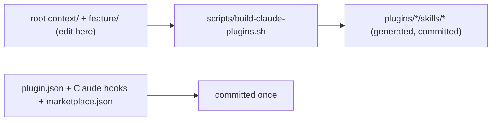

# Turn `context` and `feature` into Claude Code plugins

## Approach (confirmed)

- Distribution: **Option B** — the repo `hferello/ai` becomes a Claude Code plugin marketplace exposing two plugins: `context` and `feature`.
- Storage: **single source of truth = root [context/](context/) and [feature/](feature/) folders** (your Cursor skills). A generator copies them into the Claude plugin layout. No symlinks (they break on `git clone` / Windows).

## Target structure

```text
.claude-plugin/
  marketplace.json            # lists both plugins (curated)
plugins/
  context/
    .claude-plugin/plugin.json   # curated
    skills/context/...           # GENERATED from root context/
  feature/
    .claude-plugin/plugin.json   # curated
    hooks/                       # curated (Claude-format)
      hooks.json
      planning-reminder.sh
      planning-check-complete.sh
    skills/feature/...           # GENERATED from root feature/
scripts/build-claude-plugins.sh  # the generator
```

## How sync works



You edit the root skill, run the generator, commit. Curated wrappers rarely change.

## Steps

1. **Cleanup** — remove the empty `plugins/context7-docs-plugin/` scaffold (already removed during research).
2. **Generator** — `scripts/build-claude-plugins.sh` (drafted): for each skill, wipe+recreate `plugins/<name>/skills/<name>/`, copy `SKILL.md` + `references/`/`scripts/`/`templates/`, then rewrite `~/.cursor/skills/<name>` -> `${CLAUDE_PLUGIN_ROOT}/skills/<name>` and soften the "no hooks in Cursor" note. Cursor-only files (`install.sh`, `update.sh`, `*.ps1`, `package.sh`, `README.md`) are not copied.
3. **Manifests** — `plugins/context/.claude-plugin/plugin.json` (drafted) and `plugins/feature/.claude-plugin/plugin.json` (name, version, description, author `hferello`, repository, `license: GPL-3.0`, keywords).
4. **Port feature hooks to Claude format** (curated, in `plugins/feature/hooks/`):
   - `hooks.json`: `PreToolUse` (matcher `Bash`) -> `planning-reminder.sh`; `Stop` -> `planning-check-complete.sh`, using `"${CLAUDE_PLUGIN_ROOT}"/hooks/...`.
   - `planning-reminder.sh`: read stdin, use `.cwd` (Claude) instead of `workspace_roots` (Cursor); if `features/*/task_plan.md` or phased `overview.md` exists, emit `{"hookSpecificOutput":{"hookEventName":"PreToolUse","permissionDecision":"allow","additionalContext":"..."}}`; else exit 0 silently.
   - `planning-check-complete.sh`: read stdin, honor `.stop_hook_active` to avoid loops, run `${CLAUDE_PLUGIN_ROOT}/skills/feature/scripts/check-complete.sh` per active plan, advisory output, exit 0 (non-blocking).
5. **Marketplace** — `.claude-plugin/marketplace.json` with `name`, `owner`, and `plugins[]` pointing at `./plugins/context` and `./plugins/feature`.
6. **Generate + verify** — run the build script; if available, run `claude plugin validate ./plugins/context` and `./plugins/feature`; spot-check generated `SKILL.md` paths.
7. **Docs** — add a "Claude Code" section to [README.md](README.md) with `/plugin marketplace add hferello/ai` then `/plugin install context@<marketplace>` / `feature@<marketplace>`; add a short `plugins/README.md` explaining the generated-vs-curated split and the build command.

## Notes / decisions

- Author set to `hferello` (no real name assumed); change if you want.
- License `GPL-3.0` to match repo [LICENSE](LICENSE).
- Cursor install scripts remain untouched, so existing Cursor users are unaffected.
- Hooks are a real upgrade on Claude (Cursor couldn't auto-run them); manual-discipline guidance stays as a fallback.

## Out of scope (unless you want it)

- Publishing/announcing the marketplace, CI to auto-run the generator, or converting `context` to also ship hooks.
