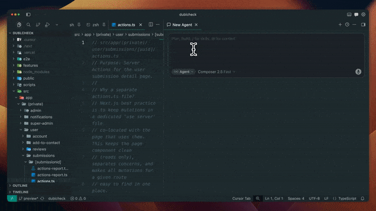

# /arch-flow

Helps Cursor write architecture notes with simple diagrams and plain language (not raw code). Optionally creates an editable FigJam diagram when you ask for one and the Figma plugin is enabled.

**Demo:**



**Install:** In Cursor, open **Terminal → New Terminal**, paste the line below, press Enter, then **fully quit and reopen Cursor**.

```bash
git clone --depth 1 https://github.com/hferello/ai.git /tmp/cursor-arch-flow && bash /tmp/cursor-arch-flow/arch-flow/install.sh && rm -rf /tmp/cursor-arch-flow
```

## How to use

In Agent chat, paste one of these:

```text
/arch-flow document the contact form flow
```

Markdown only — writes `arch-flow.md` beside the feature.

```text
/arch-flow document the contact form flow and create a FigJam diagram
```

Markdown plus an editable FigJam board (requires the Figma plugin enabled in Cursor). The agent writes `arch-flow.md` first, then generates the diagram and links it in the doc under **Visual diagram**.

## Example output

Ask the agent with `/arch-flow document the contact form flow` (or the FigJam variant above). It writes an `arch-flow.md` next to the feature. Here is a trimmed version of what that file looks like:

````markdown
# Contact form: arch flow

## High-Level Flow

```text
┌─────────────────────────────────────────────────┐
│  Contact form (client component)                │
│  - User submits name, email, and message        │
└────────────────────────┬────────────────────────┘
                         │
                         ▼
┌─────────────────────────────────────────────────┐
│  submitContact() server action                  │
│  - Validate input with Zod before anything else │
└────────────────────────┬────────────────────────┘
                         │
                         ▼
┌─────────────────────────────────────────────────┐
│  Resend API                                     │
│  - Send the message to the team inbox           │
└────────────────────────┬────────────────────────┘
                         │
                         ▼
┌─────────────────────────────────────────────────┐
│  Result returned to the form                    │
│  - Toast shows success or a safe error message  │
└─────────────────────────────────────────────────┘
```

## Data Flow

```text
on submit:
  collect name, email, message from the form
  call submitContact(form_data)

submitContact(form_data):
  validate form_data with the Zod schema
  if invalid: return field errors to the form
  send email via Resend to the team inbox
  if send fails: log the error, return a safe error message
  on success: return ok so the form can show a toast
```

## Error Handling Flow

```text
invalid input    -> return field errors, nothing is sent
email send fails -> log server-side, show a generic "try again" message
success          -> clear the form, show a success toast
```

## Visual diagram

Editable FigJam version of this flow: [Open in FigJam](https://figma.com/board/...)
````

Notice what it does and does not contain: plain pseudocode instead of real code, simple boxes instead of screenshots, and no raw SQL. The goal is a map you can read in a minute, not a second copy of the codebase. The **Visual diagram** section appears only when you ask for FigJam.
