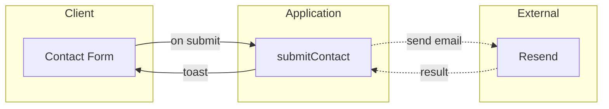

# FigJam architecture diagram (services / datastores)

Use for **High-Level Flow**, **Component Architecture**, and **Security Architecture** when the doc shows services, gateways, datastores, queues, or external APIs as a system map.

Read this file before calling `generate_diagram`.

## Mermaid rules (required)

1. `flowchart LR` only.
2. **Every node must be inside a subgraph.** Subgraph IDs must be exactly one of: `client`, `gateway`, `service`, `datastore`, `external`, `async`.
3. Display labels via quoted titles: `subgraph service ["Core Services"]`.
4. Edges to/from `async` or `external` nodes use dotted syntax: `-.->`.
5. Node IDs: camelCase, no underscores.
6. Labels and edge text in double quotes when needed.
7. No emojis, no HTML, no `\n` in labels.
8. One independently deployable unit per node — match names from `arch-flow.md`.

## Subgraph guide

| ID | Put here |
| -- | -------- |
| `client` | Web/mobile UI, CLI, end user |
| `gateway` | Load balancer, API gateway, CDN edge |
| `service` | Server actions, API routes, workers, cron handlers |
| `datastore` | Postgres, Redis, S3, caches |
| `external` | Stripe, Resend, OAuth providers, third-party SaaS |
| `async` | Queues, topics, event buses |

## Allowed edge patterns

| From | To | Syntax |
| ---- | -- | ------ |
| `client` | `gateway` | `-->` or `<-->` |
| `gateway` | `service` | `-->` |
| `service` | `service` | `-->` |
| `service` | `datastore` | `-->` |
| `service` | `async` | `-.->` |
| `async` | `service` | `-.->` |
| `service` | `external` | `-.->` |

Never connect edges to subgraph IDs — connect to nodes inside them.

## Example



## Calling generate_diagram

```text
name: "Contact form system architecture"
mermaidSyntax: (source above)
useArchitectureLayoutCode: "FIGMA_DIAGRAM_2026"
userIntent: (optional)
```

Do **not** call `create_new_file` first. Add the returned link to `arch-flow.md` under **Visual diagram**.
