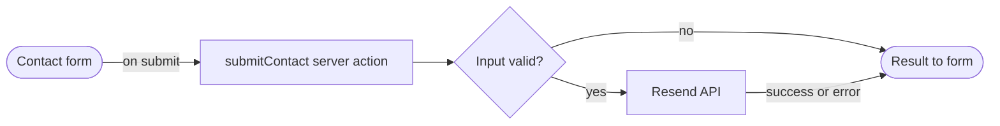

# FigJam flowchart (process / data / error flows)

Use for **Data Flow**, **Early Exit Paths**, and **Error Handling Flow** sections from `arch-flow.md`. These are step-by-step flows, not full system architecture.

Read this file before calling `generate_diagram`. Do **not** pass `useArchitectureLayoutCode`.

## Mermaid rules (required)

1. `flowchart LR` — default for sequential steps.
2. Node IDs: camelCase, no spaces (`submitContact`, not `submit_contact`).
3. Wrap labels in double quotes when they contain special characters: `A["Validate input"]`.
4. Edge labels: short verbs, quoted: `-->|"on success"|`.
5. No emojis, no HTML, no `\n` in labels.
6. Avoid node IDs: `end`, `subgraph`, `graph`.
7. Match steps to `arch-flow.md` — do not invent nodes.

## Shape hints

| Shape | Mermaid | Use for |
| ----- | ------- | ------- |
| Stadium | `start([Start])` | Entry |
| Rectangle | `step[Step name]` | Process step |
| Diamond | `check{Valid?}` | Decision / branch |
| Cylinder | `db[(Table name)]` | Database read/write |
| Stadium | `endNode([End])` | Exit |

## Contact form example

From a typical `arch-flow.md` high-level flow:



## Calling generate_diagram

```text
name: "Contact form architecture flow"
mermaidSyntax: (source above)
userIntent: (optional — what the user asked for)
```

Do **not** call `create_new_file` first — the tool creates its own FigJam file.

After generation, add the returned link to `arch-flow.md` under **Visual diagram**. Reuse the same file on iterations via `fileKey` from `figma.com/board/{fileKey}/...`.
