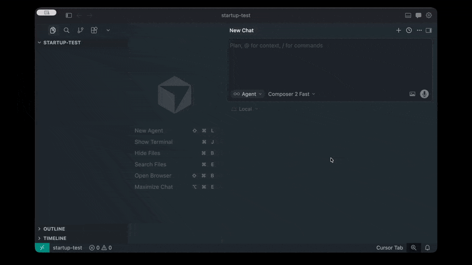

# Context

A Cursor skill that captures product context so AI agents stay aligned. Run `/context` and it walks you through 8 direct questions — one at a time — writing everything to a single file: `docs/context.md`.

Not sure about an answer? Say "you tell me" and the agent will research it for you.

**Project rule:** `cursor-rule.mdc` tells agents to read `docs/context.md` before non-trivial work. It lives **per repo** at `.cursor/rules/context.mdc` — not in your global Cursor config — so each project’s guardrails travel with the code (commit it).

**Demo:**



**Install the skill** (once per machine): Open a terminal in Cursor, paste this, hit Enter, then fully quit and reopen Cursor.

```bash
git clone --depth 1 https://github.com/hferello/ai.git /tmp/cursor-skill && bash /tmp/cursor-skill/context/install.sh && rm -rf /tmp/cursor-skill
```

**Install the rule** (once per project — from the same clone, or after cloning this repo):

```bash
bash /path/to/context/install-project-rule.sh /path/to/your-project
# or from your project root, if context/ is next to you:
bash ../context/install-project-rule.sh .
```

That copies `cursor-rule.mdc` to `<project>/.cursor/rules/context.mdc`. Commit that file.

---

## Using `/context`

### 1. Start (optional seed)

```text
/context

/context — a simple app for freelancers to snap receipts and track deductions
```

### 2. Answer the questions (or don't)

The agent asks 8 questions in this order: product, mission, principles, must-haves, constraints, boundaries, stack, and success criteria. One per turn. You can answer, skip, or say "you tell me." After each answer `docs/context.md` is updated on disk.

If a codebase already exists, the agent uses it to ground the stack question and folds any confirmed details into `## Tech Stack & Conventions` only when they're useful.

### 3. Resume if interrupted

If a session dies mid-flow, just run `/context` again. The agent reads `docs/context.md`, finds the last filled section, and picks up from there.

### 4. Review

After the last question, the agent reads back the full document and asks for final edits. There is only **one** context file per repo: `docs/context.md`.

## Examples

Finished examples live in `references/` to show what a tight context doc looks like.
