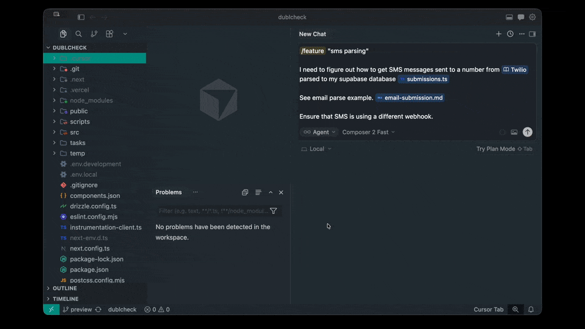

# /feature


A skill for Cursor that helps you think before you build. Whether you're designing a feature, researching a problem, or kicking off a multi-step project, `/feature` asks the right questions first and keeps your work organized in a small set of living docs — a task plan, findings, progress log, documentation, and a **PRD**.

**Demo:**



**Install:** Open a terminal in Cursor, paste this, hit Enter, then fully quit and reopen Cursor.

```bash
git clone --depth 1 https://github.com/hferello/ai.git /tmp/cursor-feature-skill && bash /tmp/cursor-feature-skill/feature/install.sh && rm -rf /tmp/cursor-feature-skill
```

---

## Using `/feature`

### 1. Give it a name

Start with `/feature` followed by a short name in quotes. This becomes the label for the work and maps to a folder under `features/`.

```text
/feature "checkout flow"
```

Lowercase, hyphens are fine. The name doesn't need to be perfect — the init script tidies it up.

### 2. Answer a few questions, then go

The agent kicks off with a round of clarifying questions (you can skip this if you already know what you want), then scaffolds `features/<your-task>/` with everything it needs to track the work: `task_plan.md`, `findings.md`, `progress.md`, `documentation.md`, and `prd.md`. From there, you iterate.

---

## Inspiration

The workflow and “plan with living docs” idea for this skill take their cue from [planning-with-files](https://github.com/OthmanAdi/planning-with-files) (Othman Adi), which was used as the starting point for how `/feature` structures task plans, findings, and related files.

---

For the full workflow, hooks, Windows install, or uninstall instructions, see [references/more.md](references/more.md).
