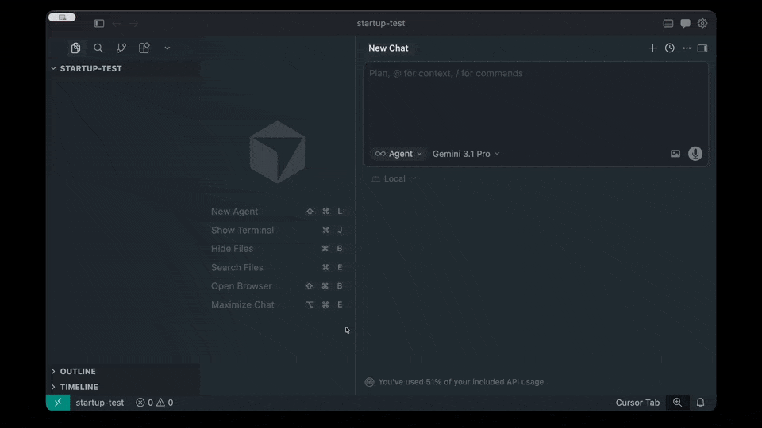

# /spec

A Cursor skill that turns a raw idea into a PRD so your agents stay aligned with what to build. Ask `/spec "project-name"` and it walks you through 9 focused questions — one at a time — to produce a lightweight PRD at `docs/prds/<slug>.md`.

Not sure about an answer? Say "you tell me" and the agent will research it for you.

**Always-on rule:** `cursor-rule.mdc` is the source of truth. Installing with `install.sh` copies it to `~/.cursor/rules/spec.mdc` so agents treat `docs/prds/` PRDs as the spec in every project. In this repo, `.cursor/rules/spec.mdc` is a symlink to `spec/cursor-rule.mdc`.

**Demo:**



**Install:** Open a terminal in Cursor, paste this, hit Enter, then fully quit and reopen Cursor.

```bash
git clone --depth 1 https://github.com/hferello/ai.git /tmp/cursor-spec-skill && bash /tmp/cursor-spec-skill/spec/install.sh && rm -rf /tmp/cursor-spec-skill
```

---

## Using `/spec`

### 1. Give it a name and a seed idea

```text
/spec "expense-tracker" — a simple app for freelancers to snap receipts and track deductions
```

### 2. Answer the questions (or don't)

The agent asks 9 questions, one per turn. You can answer, skip, or say "you tell me" to let the agent research it. After each answer the PRD file is updated on disk — nothing is lost if the session breaks.

### 3. Review the PRD

After the last question, the agent reads back the full PRD and asks for final edits. The finished doc lives at `docs/prds/<slug>.md` where any future agent session can reference it.
